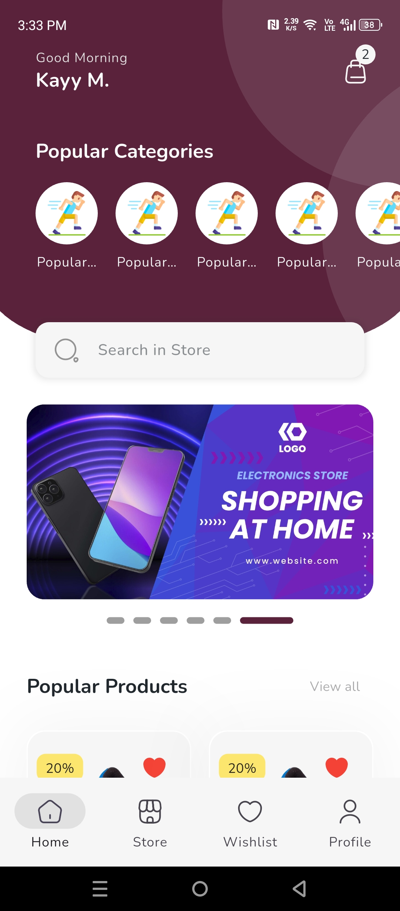

<!-- Header -->
<h1 align="center">Hi 👋, I'm Kainat Mustajab</h1>
<h3 align="center">A passionate Flutter Developer 🚀</h3>

---

## 🌟 About Me
- Specializing in **Mobile Application Development - Flutter**  
- Passionate about building scalable and user-friendly applications  
- Reach me at **kmustajab89@gmail.com**  
- [LinkedIn](https://www.linkedin.com/in/kainat-m-1b28b72a7/) | [GitHub](https://github.com/kmustajabjava)

---

## 🛠 Tech Stack

---

## 📂 Featured Projects

### 1. Cold Storage Inventory & Loan Management App *(Company Project)*
A mobile app for inventory management, loan tracking, and payment handling in cold storage facilities.  
- Role-based authentication with localization (English/Urdu)  
- SSL integration for secure API communication  
- Dynamic forms & multilingual support  

**Tech Stack:** Flutter, Dart, GetX, Dio, REST APIs, Android Studio  

**📷 Screenshots:**  

  
  
  
  

---

### 2. Medical Patient Registry App *(Company Project)*
A medical registry app for managing patient data, enabling file uploads, image compression, and Excel report generation.  
- Image compression using Dart isolates for optimized uploads  
- REST API integration with custom error handling  
- File handling with MethodChannel & Android MediaStore  

**Tech Stack:** Flutter, Dart, GetX, Dio, REST APIs, Android Studio  

**📷 Screenshots:**  

  
  
  

---

### 3. ParkEase — Smart Parking Management *(Final Year Project)*
A smart parking management app with separate customer & admin panels.  
- Slot availability checking & booking based on time/type (shaded/unshaded)  
- Real-time slot management with GetX  
- Payment calculation based on duration  

**Tech Stack:** Flutter, Dart, Firebase, Firestore, GetX, Google Maps API, Android Studio  

**🎥 Demo + Screenshots:**  

  
  
  
  

---

### 4. Login App — Onboarding & Google Sign-In
A simple onboarding & authentication app with animations.  
- Firebase Authentication  
- Google Sign-In integration  
- Animated onboarding screens  

**Tech Stack:** Flutter, Dart, Firebase Auth, Google Sign-In, Android Studio  

**🎥 Demo + Screenshots:**  

  
  
  
  

---

### 5. E-commerce App UI
UI design for a modern e-commerce mobile app.  
- Product listing pages  
- Product detail view  
- Add-to-cart mockup  

**Tech Stack:** Flutter, Dart, GetX, Android Studio  

**🎥 Demo + Screenshots:**  

  
  
  
  

---

